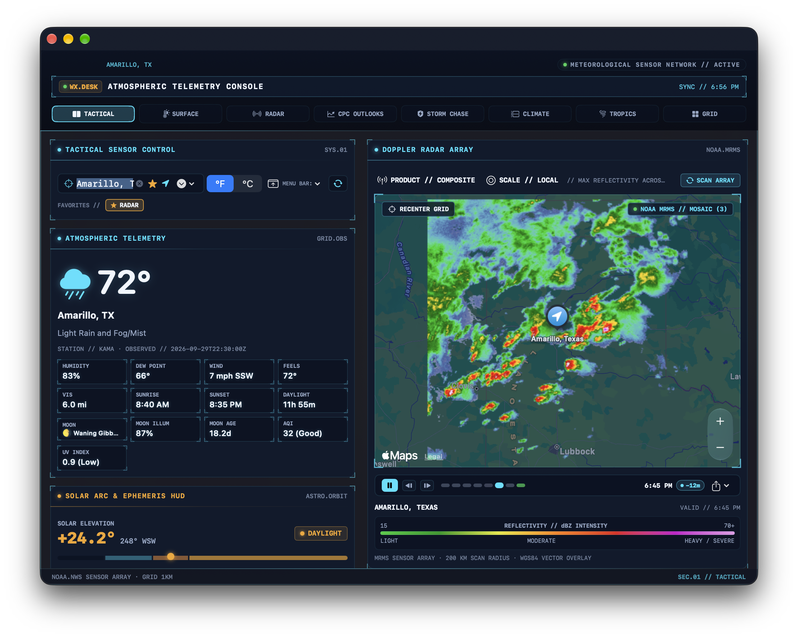
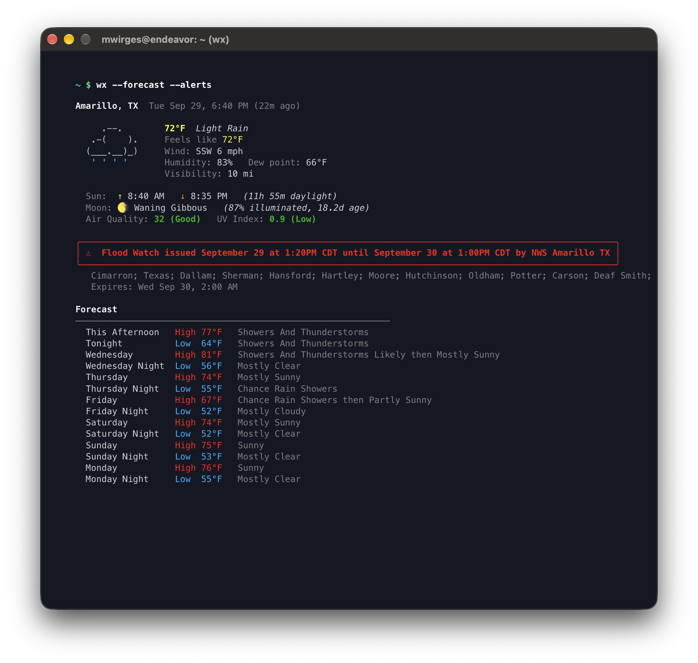
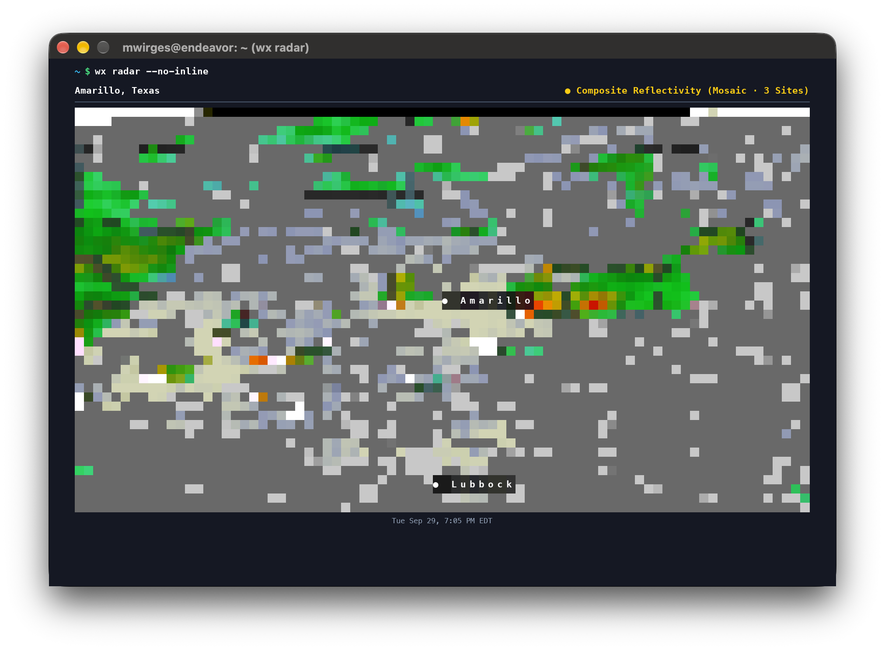

# wx

A terminal weather suite and native macOS app. Fetches current conditions, synoptic forecasts, quantitative nowcasting, atmospheric soundings, SPC convective outlooks, NHC tropical tracking, climate normals, astronomical ephemerides, and active alerts from the [National Weather Service](https://www.weather.gov) (US) and [Open-Meteo](https://open-meteo.com) (Global) APIs — no API key required.

Features colorized truecolor output in the terminal, interactive Doppler radar with animated GIF export, specialized meteorological intelligence subcommands, piped JSON for shell automation, and a native SwiftUI macOS app with live radar maps.

---

## Screenshots

### macOS App (`wx.app`)

Tactical Command Console (`WX.DESK`) featuring live atmospheric telemetry, solar elevation arc HUD, active weather alerts, multi-station tactical grid, and interactive vector Apple Maps Doppler radar overlay.

<p align="center">
  
</p>

### CLI App

Colorized terminal weather output with ASCII weather art, sun/moon astronomical ephemerides, active NWS alert warning boxes, 7-day forecast, and Unicode half-block Doppler radar.

| Forecast & Conditions (`wx --forecast --alerts`) | Doppler Radar (`wx radar --no-inline`) |
|:---:|:---:|
|  |  |

---

## Installation

### macOS App (DMG Installer)

Install the native macOS SwiftUI app via disk image:

1. Download `wx.dmg` or build it locally with:
   ```bash
   make dmg
   # (or: make mac-dmg)
   ```
2. Open `build/wx.dmg` and drag **`wx.app`** into **`/Applications`**.

> **Note:** The `wx.app` bundle includes both the native macOS menu bar HUD / Command Console and the embedded `wx-cli` binary inside `wx.app/Contents/MacOS/wx-cli`.

### CLI App

```bash
# Build locally
make build          # → build/wx

# Install to $GOPATH/bin
go install github.com/mwirges/wx@latest
```

## CLI Usage

```
wx [options] [location]
wx <subcommand> [options] [location]

Global Options:
  -l, --location <value>   Zip code, "City, ST", coordinates, or omit to auto-detect
  -f, --forecast           Show 7-day forecast
  -H, --hourly             Show hourly forecast
  -s, --short              Single-line summary for statuslines/prompts
  -T, --template <string>  Format output with a Go template or @file
  -a, --alerts             Show active weather alerts
  -u, --units <value>      imperial (default) or metric
      --no-cache           Bypass the local cache
  -j, --json               Force JSON output even in a terminal
      --exit-code-on-alerts Exit 2 on warnings, 1 on watches/advisories, 0 on normal
      --help               Show help
      --version            Print version

Subcommands:
  nowcast, precip          Quantitative 15-minute precipitation nowcasting & sparkline
  climate, records         NOAA 30-year normals, daily anomalies, and all-time records
  sounding, cape           Upper-air sounding thermodynamics (CAPE, CIN, shear, Skew-T)
  tropics, nhc             Active tropical cyclones & hurricanes from National Hurricane Center
  spc, chase               Storm Prediction Center convective outlooks & mesoscale discussions
  aqi, air                 Air Quality Index (AQI), PM2.5, ozone, and smoke plume telemetry
  astro, ephem             Solar elevation arc, civil/nautical twilight horizons, lunar phases
  outlook, synoptic        NWS Area Forecast Discussion (AFD) and CPC extended outlooks
  radar                    NEXRAD & MRMS Doppler reflectivity, animated loops, and GIF export
  monitor                  Full-screen live weather dashboard with auto-refresh
  locations                Manage named favorite aliases, per-location settings, and history
  config                   Manage default settings and configuration
```

### Quick Examples

```bash
# Current conditions, auto-detected location
wx

# Current conditions for a specific city or zip
wx "Amarillo, TX"
wx 79101

# Forecast + active severe weather alerts together
wx "Amarillo, TX" --forecast --alerts

# Single-line compact summary (great for tmux / shell prompts / waybar)
wx --short
# Output: Amarillo, TX: 72°F (feels 72°F) · SSW 7 mph · 83% hum · ↑8:40 AM ↓8:35 PM 🌖 · 22m ago

# Hourly forecast (table layout with precip % and humidity)
wx --hourly
wx hourly "Austin, TX" --hours 12

# Custom templating (inline or from file with @)
wx -T '{{.Conditions.Location}}: {{.Conditions.TempStr}} ({{.Conditions.Description}})'
wx -T '{{.Conditions.TempF | printf "%.0f"}}°F | {{.Astronomy.MoonPhaseIcon}} {{.Astronomy.MoonPhase}} | {{.Conditions.Astronomy.Sunrise}} - {{.Conditions.Astronomy.Sunset}} [{{.Freshness.AgeString}}]'
wx -T @~/.config/wx/tmux.tmpl

# Automation / scripting with alert exit codes
wx --exit-code-on-alerts "Amarillo, TX"
# Exit status: 2 = Severe Warning, 1 = Watch/Advisory, 0 = Normal

# Metric units
wx "Denver, CO" --forecast --units metric

# JSON output (automatic when piped or forced with -j)
wx "Chicago, IL" --json | jq .conditions.temperature_f

# Skip the cache (force a fresh fetch)
wx --no-cache
```

---

## Doppler Radar Suite

```bash
wx radar                                # composite reflectivity, auto-detected location
wx radar "Amarillo, TX" --no-inline     # Unicode half-block rendering in any terminal
wx radar --interactive                  # full-screen interactive TUI with pan, zoom & looping
wx radar --loop                         # 6-frame animated terminal loop (Ctrl+C to exit)
wx radar --loop --frames 12 --interval 400

# High-resolution image export
wx radar --save /tmp/radar.png          # save static high-resolution radar PNG
wx radar --save-gif /tmp/radar.gif      # render & export animated radar loop directly to GIF
wx radar --save-gif storm.gif --frames 16 --interval 350

# Radar products and stations
wx radar --product base-reflectivity
wx radar --product storm-relative-velocity
wx radar --product echo-tops
wx radar --radius 150                   # km radius around location (default 200)
wx radar --station KAMA                 # center on a specific NEXRAD station
```

**Products:**

| Product | Description |
|---------|-------------|
| `composite-reflectivity` | National CONUS mosaic (default) |
| `base-reflectivity` | Single-station, lower-tilt scan |
| `storm-relative-velocity` | Velocity adjusted for storm motion |
| `echo-tops` | MRMS enhanced echo tops (cloud heights, kft) |
| `precip-type` | MRMS surface precipitation classification (rain, snow, ice) |
| `one-hour-precip` | 1-hour quantitative precipitation accumulation (QPE) |
| `storm-total-precip` | Storm total precipitation accumulation |

**Rendering:** wx auto-detects your terminal. In iTerm2, Kitty, Ghostty, and WezTerm it sends a full 1600×1600 PNG via inline image protocol. In all other terminals it renders Unicode half-block characters (`▀`) with ANSI truecolor. Use `--no-inline` to force half-block rendering anywhere.

### Interactive Radar TUI (`--interactive`)

Full-screen TUI with live radar navigation. Press `R` in `wx monitor` to open the radar panel there instead. Selected products and zoom radii are automatically saved per-location.

| Key | Action |
|-----|--------|
| `p` | Cycle product (composite → base → SRV → echo tops → precip type → 1h → storm total) |
| `+` / `-` | Zoom in / out |
| `l` | Toggle loop animation |
| `space` | Pause / resume loop |
| `←` / `→` | Step through frames manually |
| `<` / `>` | Adjust loop speed slower / faster |
| `r` | Refresh radar scan |
| `q` | Quit |

---

## Meteorological Intelligence Subcommands

`wx` includes a suite of specialized diagnostic subcommands designed for meteorologists, storm chasers, outdoor athletes, and pilots:

### 1. Quantitative Nowcasting (`wx nowcast` / `wx precip`)

Minute-by-minute next-hour rain timeline and 15-minute quantitative precipitation forecasts (QPF) with rate intensity sparklines:

```bash
wx nowcast "Amarillo, TX"
wx precip "Austin, TX" --hours 6
```
```
High-Resolution Precipitation Nowcast
Amarillo, Texas · Observed: 6:45 PM · Model: HRRR / Rapid Refresh (NWS)

Precipitation Trend: Rain starting in 15 min · Peak intensity at 7:30 PM (0.69 in/h)

TIMELINE (15-MIN INTERVALS)
TIME        CONDITIONS          PRECIP PROB   INTENSITY RATE   ACCUMULATION  SPARKLINE
───────────────────────────────────────────────────────────────────────────────────────
06:45 PM    Light Rain          85%           0.02 in/h       0.01 in       ▂
07:00 PM    Moderate Rain       88%           0.18 in/h       0.04 in       ▄
07:15 PM    Heavy Rain          92%           0.45 in/h       0.11 in       ▆
07:30 PM    Heavy Thunderstorms 95%           0.69 in/h       0.17 in       ▇
```

### 2. NOAA Climate Normals & Records (`wx climate` / `wx records`)

30-year climatological normals (1991–2020 baseline), daily temperature departures, and all-time records evaluated across multi-decade archives:

```bash
wx climate "Amarillo, TX"
wx records "Denver, CO"
```
```
NOAA 30-Year Climate Normals & Historical Records
AMARILLO AP (23047 1) · Elev 3607 ft · Tue Sep 29 · Base: 1991–2020

[WARM ANOMALY] +5.6°F Departure (Above Normal)

DAILY NORMALS (30-YEAR BASELINE)
Normal High: 80.0°F    Normal Low: 52.0°F    Normal Mean: 66.0°F    Normal Precip: 0.06 in

ALL-TIME DAILY RECORDS FOR THIS CALENDAR DAY
All-Time Record High:  96.0°F (2023)
All-Time Record Low:   32.0°F (1984, 1985)
Coldest Daytime High:  39.0°F (1945)
Warmest Nighttime Low: 68.0°F (2019)
Max Daily Precip:      2.33 in (1990)
Historical Archive:    1941–2025 (85 years evaluated)
```

### 3. Upper-Air Atmospheric Soundings (`wx sounding` / `wx cape`)

Thermodynamic sounding index calculations, instability indices (CAPE, CIN, Lifted Index), deep-layer shear, vertical levels, and direct links to interactive Skew-T log-P diagrams:

```bash
wx sounding "Amarillo, TX"
wx cape "Norman, OK" --station KOUN
```
```
Upper-Air Thermodynamic Sounding & Instability Analysis
Station: KAMA (Amarillo, TX) · Model: RAP / Radiosonde 00Z Analysis

THERMODYNAMIC INDICES
  SBCAPE:  1850 J/kg  [Moderate Instability]
  MLCAPE:  1420 J/kg  [Severe Storm Potential]
  SBCIN:   -25 J/kg   [Weak Cap]
  Lifted:  -4.8 °C    [Unstable]
  0-6km Bulk Shear:   42 kt  [Supercell Organization Favored]

Skew-T log-P Diagram: https://weather.cod.edu/analysis/sounding/KAMA
```

### 4. NHC Tropical Cyclone Intelligence (`wx tropics` / `wx nhc`)

Real-time National Hurricane Center monitoring across the Atlantic, Caribbean, Gulf of Mexico, Eastern Pacific, and Central Pacific:

```bash
wx tropics
wx nhc "Miami, FL"
wx nhc --storm Rachel
```
Displays active storms, hurricanes, depressions, Saffir-Simpson intensity categories, minimum central pressure, forward motion vectors, proximity distance, active coastal watches/warnings, and official NHC forecast cone graphics.

### 5. Storm Prediction Center Convective Risk (`wx spc` / `wx chase`)

NOAA Storm Prediction Center convective outlooks, categorical risk levels (Marginal, Slight, Enhanced, Moderate, High), Mesoscale Discussions, and probabilistic hail/wind/tornado hazard footprints:

```bash
wx spc "Amarillo, TX"
wx chase "Oklahoma City, OK" --day 1
```

### 6. Air Quality Index & Smoke Plumes (`wx aqi` / `wx air`)

Real-time US EPA AQI, WHO UV Index, particulate concentrations (PM2.5, PM10), and chemical pollutant concentrations (Ozone, NO2, CO, SO2):

```bash
wx aqi "Amarillo, TX"
wx air "Salt Lake City, UT"
```

### 7. Astronomical Ephemeris & Solar Arc (`wx astro` / `wx ephem`)

100% offline Meeus & NOAA astronomical calculations for solar elevation angles, azimuth, sunrise/sunset, golden hours, civil/nautical/astronomical twilight horizons, and high-precision lunar phase cycles:

```bash
wx astro "Amarillo, TX"
wx ephem "Seattle, WA"
```

### 8. Synoptic Discussions & CPC Outlooks (`wx outlook` / `wx synoptic`)

NWS Area Forecast Discussions (AFD) directly from the local forecast office and Climate Prediction Center (CPC) 6–10 / 8–14 day temperature and precipitation outlooks:

```bash
wx outlook "Amarillo, TX"
wx synoptic "Chicago, IL"
```

---

## Monitor Dashboard

Full-screen live weather dashboard with auto-refresh, alert notification banners, and split-screen radar.

```bash
wx monitor                        # current conditions + forecast, auto-detected location
wx monitor --location "Amarillo, TX"
wx monitor --units metric
wx monitor --interval 5m          # refresh interval (default 15m)
wx monitor --notify               # enable desktop notifications for new weather alerts
wx monitor --hourly               # start directly in hourly forecast mode
```

| Key | Action |
|-----|--------|
| `R` | Toggle live Doppler radar panel (splits screen left/right) |
| `H` | Toggle between hourly and daily 7-day forecast |
| `r` | Refresh weather now |
| `l` | Change location (type to filter; `tab`/`↑`/`↓` to cycle favorites & recents) |
| `↑` / `↓` | Scroll forecast |
| `q` | Quit |

---

## Configuration & Favorite Locations

Preferences are persisted in `~/.config/wx/config.json`. Configure via CLI or edit directly:

```bash
# Set a default location
wx config set --location "Amarillo, TX"

# Set default units and desktop notifications
wx config set --units imperial --notifications true

# Set menu bar HUD format (standard, compact, tactical, icon, conditions, ephemeris, minimal)
wx config set --menu-bar-format tactical

# View current configuration
wx config show
```

### Named Favorite Aliases & Per-Location Defaults

Manage named favorite aliases with customized radar products and zoom radii:

```bash
# Add favorites with per-location preferences
wx locations add Home "Amarillo, TX" --station KAMA --radar-radius 150
wx locations add Cabin "Sedona, AZ" --units imperial
wx locations add Work "Chicago, IL" --units metric

# Configure per-location settings
wx locations config Home --radar-product base-reflectivity --radar-radius 120
wx locations config Home              # show custom settings
wx locations config Home --clear      # reset to defaults

# Use your favorite alias anywhere in the CLI
wx Home
wx Home --forecast
wx radar Home
wx monitor Home

# List favorites and recent search history
wx locations
wx locations recents
wx locations clear-recents
wx locations rm Cabin
```

`~/.config/wx/config.json` example:

```json
{
  "default_location": "Amarillo, TX",
  "units": "imperial",
  "menu_bar_format": "tactical",
  "notifications": true,
  "favorites": [
    {"name": "Home", "value": "Amarillo, TX"},
    {"name": "Work", "value": "Chicago, IL"}
  ],
  "recent_locations": [
    "Amarillo, Texas",
    "Austin, Texas",
    "Oklahoma City, Oklahoma"
  ],
  "per_location": {
    "Home": {
      "radar_station": "KAMA",
      "default_radar_radius": 150,
      "default_radar_product": "base-reflectivity"
    }
  }
}
```

---

## Weather Providers & Architecture

`wx` uses a prioritized, self-healing provider registry (`docs/provider-design.md`):

1. **National Weather Service (`nws`)**: Specialized high-fidelity data for US coordinates (`PrioritySpecialized: 100`).
2. **Open-Meteo (`openmeteo`)**: Universal keyless fallback for global coordinates (`PriorityFallback: 10`).

Selection is automatic: US locations query NWS by default; international locations (e.g. Toronto, London, Tokyo, Paris) automatically query Open-Meteo. If NWS encounters an upstream service outage, `wx` transparently falls back to Open-Meteo.

You can explicitly force a provider via CLI or config:
```bash
wx --provider openmeteo "Amarillo, TX"
wx config set --provider openmeteo
```

---

## Native macOS App (`wx.app`)

A native SwiftUI application for macOS 14+ (`macos/`):

- **Menu Bar HUD (`WX.HUD`)**: Sits cleanly in the macOS menu bar. Offers 7 customizable display formats:
  - `standard`: Temperature + icon (`72°F 🌧`)
  - `compact`: Temperature only (`72°F`)
  - `tactical`: Station code + temperature + severe status (`KAMA 72°F ⚠️`)
  - `conditions`: Temperature + sky description (`72°F Light Rain`)
  - `ephemeris`: Temperature + solar elevation arc + moon phase (`72°F ☀️+24° 🌖`)
  - `icon`: Icon glyph only (`🌧`)
  - `minimal`: Clean status indicator
- **Command Console (`WX.DESK`)**: A tactical desktop operations center:
  - **8 Specialized Tabs**: `Tactical` (dual-pane telemetry & radar), `Surface` (expanded observations), `Radar` (edge-to-edge animated Doppler map), `CPC Outlooks` (extended probabilities), `Storm Chase` (SPC convective intelligence), `Climate` (30-year normals & anomalies), `Tropics` (NHC hurricane tracking), and `Grid` (multi-location telemetry grid).
  - **Live Doppler Radar Array**: Vector Apple Maps overlay with MRMS composite and NEXRAD single-station sweeps, animated frame scrubber, playback speed controls, and auto-refresh.
  - **Solar Arc & Ephemeris HUD**: Real-time solar elevation angle, azimuth, daylight arc progress, and twilight horizon thresholds.
  - **Air Quality & UV Card**: EPA AQI gauge, UV index, and chemical particulate breakdown.
- **Embedded Engine**: The app bundle automatically embeds and invokes the compiled Go binary (`wx.app/Contents/MacOS/wx-cli`).
- **DMG Distribution**: Packaged as a drag-and-drop disk image installer via `make dmg` or `make mac-dmg`.

---

## Cache

Responses are cached in `~/.cache/wx/` to avoid unnecessary API round-trips:

| Data | TTL |
|------|-----|
| Current conditions | 10 minutes |
| Forecast | 1 hour |
| Alerts | 5 minutes |
| Grid/station lookup | 24 hours |
| Geocoding (zip/city) | 24 hours |
| IP geolocation | 1 hour |

Use `--no-cache` to bypass the local cache for a fresh fetch.

---

## Data Sources

| Purpose | Service |
|---------|---------|
| US Weather & Alerts | [api.weather.gov](https://api.weather.gov) (NWS) — Primary US meteorological data, no API key required |
| Global Weather & Fallback | [api.open-meteo.com](https://open-meteo.com) — Global international forecast coverage & fallback, no key required |
| Zip / City Geocoding | [Nominatim](https://nominatim.openstreetmap.org) (OpenStreetMap) |
| IP Geolocation | [ipinfo.io](https://ipinfo.io) (free tier) |

---

## Development

```bash
make build        # build CLI for current platform (build/wx)
make test         # run Go test suite
make test-verbose # verbose test output
make vet          # run go vet
make build-all    # cross-compile CLI for darwin/linux/windows
make mac-build    # build macOS SwiftUI app (macos/build/Build/Products/Debug/wx.app)
make mac-run      # build and launch macOS app
make mac-dmg      # package release macOS app into build/wx.dmg (alias: make dmg)
make clean        # remove build/
```
